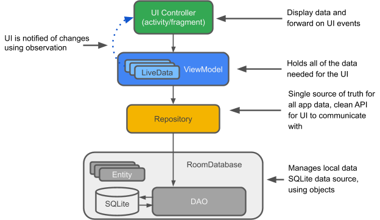

<h1 align="center">Event Manager App</h1>

  

 
Event Manager Android application built using Kotlin, MVVM and Room 

## App Screenshot

<table>
  <tr>
    <td></td>
    <td></td>
    <td></td>
  </tr>
  
  <tr>
  </tr>
 </table>

  

## Model View ViewModel Architecture

 

 

## Built With 🛠
- [Kotlin](https://kotlinlang.org/) - First class and official programming language for Android development.
- [Coroutines](https://kotlinlang.org/docs/reference/coroutines-overview.html) - A coroutine is a concurrency design pattern that you can use on Android to simplify code that executes asynchronously.
- [Android Architecture Components](https://developer.android.com/topic/libraries/architecture) - Collection of libraries that help you design robust, testable, and maintainable apps.
  - [LiveData](https://developer.android.com/topic/libraries/architecture/livedata) - Data objects that notify views when the underlying database changes.
  - [ViewModel](https://developer.android.com/topic/libraries/architecture/viewmodel) - Stores UI-related data that isn't destroyed on UI changes. 
  - [ViewBinding](https://developer.android.com/topic/libraries/view-binding) - Generates a binding class for each XML layout file present in that module and allows you to more easily write code that interacts with views.
  - [DataBinding](https://developer.android.com/topic/libraries/data-binding) - The Data Binding Library is a support library that allows you to bind UI components in your layouts to data sources in your app using a declarative format rather than programmatically.
  - [Room](https://developer.android.com/topic/libraries/architecture/room) - SQLite object mapping library.
- [Material Components for Android](https://github.com/material-components/material-components-android) - Modular and customizable Material Design UI components for Android.

 

 

## Features 👨🏼‍💻

- The User can create an Event by providing EventName, EventDate, EventLocation, EventDescription, EventParticipants.
- The user can modify (edit) an exisiting Event.
- The user can delete an exisiting Event.

   

   
  
  ## Project Structure and Files 📂

   - Model
      - Room
         - Event.kt
         - EventDao.kt
         - EventDatabase.kt
   - ViewModel
      - EventViewModel.kt
      - EventRepository.kt
   - Views
      - CreateEventFragment.kt
      - EventListFragment.kt
      - EventDetailFragment.kt
      - MainActivity.kt
  
  
